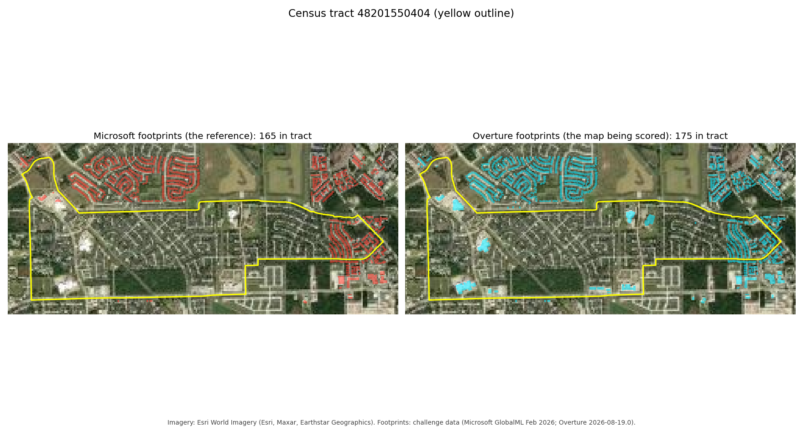
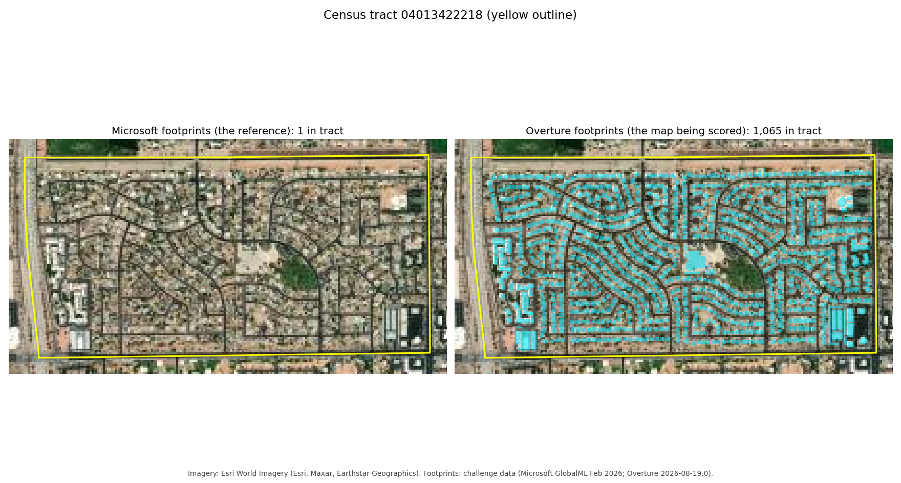

# When both maps miss the same homes

**Bias Bounty Mapping Equity Challenge: methodology write-up (Best Documentation) and Best Bias Discovery**
Zindi user `yousef_emad` · code: https://github.com/Y385471/bias-bounty-coverage-gap

---

## TL;DR

- **Methodology.** One Python file (`coverage_gap.py`) reads every layer straight from the public bucket with DuckDB. It computes the three components per tract exactly as specified and writes the submission plus every intermediate count. The first run scored RMSE 0.000145, using centroid building assignment. Bounding-box-centre assignment scored 0.000145 as well. The last 1e-4 is documented in §1.4, not hidden.
- **Discovery.** I compared the building reference (Microsoft footprints) with an independent third source: the number of residential *structures* the Census ACS implies for each tract. **78 tracts, home to 306,821 people, hold less than half a Microsoft footprint per residential structure.** These are not new subdivisions: only 4–6 % of their homes were built after 2010.
  - **Patched (47 tracts):** volunteers filled the hole. Overture has these homes almost entirely from OpenStreetMap (57,479 of 61,126 buildings).
  - **Not patched (31 tracts):** these are the poorer ones. The poverty share is 25–38 % against 15 %, and 6.6–13.7 % of households have no vehicle, against 3.3 %.
  - In the worst case, **neither map holds the homes**. The scored `building_gap` is **0 in 71 of the 78 tracts**, so the scorecard reports them as fully mapped.
- **Why the scorecard cannot see it.** Every metric compares Overture with Microsoft. When both miss the same homes they agree, so the gap is 0 and the raw disagreement is also 0. Only an independent count of homes reveals it.

---

## Part 1: Methodology

### 1.1 Data and access
Every layer is read in place from `s3://us-west-2.opendata.source.coop/humane-intelligence/bias-bounty-mapping-equity-challenge/`. The reads use DuckDB 1.5.4 (`httpfs`, `spatial`) with `s3_region='us-west-2'` and `s3_url_style='path'`. The bucket name contains dots, so virtual-host addressing breaks TLS. Nothing is downloaded, and one Colab CPU runtime scores all four regions in about 17 minutes.

| layer | file | used for |
|---|---|---|
| tract polygons | `strata/<region>/<region>-census-tracts.parquet` | spatial joins |
| scored tract list | `reference/<region>/<region>-sample-submission.csv` | the 9,379 rows (read via DuckDB; pandas/urllib gets a 403 from the proxy) |
| Overture roads / TIGER roads | `overture-roads`, `census-tiger-roads` | transport component |
| Overture / Microsoft buildings | `overture-buildings`, `microsoft-buildings` | building component |
| Overture places, USGS/HIFLD fire, EMS, schools, CBP | `overture-pois`, `hifld-*`, `census-cbp` | POI component |

### 1.2 Components (per tract)
Every gap is `1 − min(1, overture / reference)`. It is **undefined** when the reference is 0, and it is never filled with 0 before averaging.

- **Transport.** Road length inside the tract. Each segment is clipped with `ST_Intersection` and measured in EPSG:5070 with `always_xy := true`; without it, DuckDB reads the CRS84 layers as lat/lon and returns `inf`. Overture `class ∈ {motorway, trunk, primary, secondary}` is compared with TIGER `MTFCC ∈ {S1100, S1200}`.
- **Buildings.** Footprint counts, Overture against Microsoft. A footprint belongs to the tract that contains **the centre of its bounding box**, taken from the `bbox` struct. With centroid assignment the scores differ from the reference at the 1e-4 level.
- **POI.** This is the mean of two halves:
  - The facilities half is the mean of the defined per-type gaps. Overture `categories.primary` is matched against the USGS/HIFLD point layers: `fire_department` for fire stations, `ambulance_and_ems_services` for EMS, and the six school categories for schools. Hospitals are excluded, as specified.
  - The CBP half compares all Overture places with `cbp_estab`.
- **Composite.** The mean of the *defined* components, so the divisor is 1, 2 or 3 per tract.

### 1.3 Edge cases
| case | handling |
|---|---|
| zero-population tracts | scored like any other: population is not in the formula |
| water-dominated tracts (the seven `99xx` in south-central-tx) | not in the scored list, so not scored |
| a component with no reference (no named highway, no footprint, no facility, no establishment) | undefined: written as `0` with its `_defined` flag `FALSE`, and excluded from the mean |
| a tract with reference data but **no Overture data** of that kind | a full gap of 1. "Undefined" is a property of the reference side only |
| GEOID | always read as text (Maricopa is FIPS `04`) |
| rounding | components written to 6 decimals |
| column order | `GEOID, coverage_gap_score, region, …` — the scorer reads the second column |

### 1.4 Checks
- The transport component is undefined in 218 of 591 Northern California tracts, 869 of 1,593 in Maricopa, 253 of 1,192 in Eastern Oklahoma and 1,704 of 6,003 in South-Central Texas. My output matches these README counts exactly.
- Leaderboard RMSE is 0.000144981 with centroid assignment and 0.00014538 with bounding-box-centre assignment; 47 of 9,379 tracts change between the two. The residual is therefore not in building attachment, and I report it as open rather than tune against the leaderboard.

---

## Part 2: Best Bias Discovery — *volunteer-patched and double-missed homes*

### 2.1 The pattern
The building component can only see Overture falling short of Microsoft. That leaves two blind spots:
1. **The reference has a hole.** The comparison then has nothing to measure against.
2. **Both sources miss the same homes.** Overture and Microsoft agree, so the gap is 0.

The Census Bureau's ACS table **B25024, units in structure (2019–2023 5-year)** counts homes by building type, and it was never used to build either map. I converted it to an expected number of residential structures per tract:

`structures = detached + attached/2 + 2-unit/2 + (3–4)/3.5 + (5–9)/7 + (10–19)/14.5 + (20–49)/35 + (50+)/100 + mobile homes + boats/RVs`

Across all tracts with at least 150 structures, the median is **1.21 Microsoft footprints per residential structure**. That is above 1, as expected, because footprints also include garages, sheds and commercial buildings. So a tract **below 0.5** is short of at least half its homes even before any non-residential building is counted. This makes the definition conservative.

### 2.2 Evidence
| group (hole = Microsoft < 0.5 footprint per ACS residential structure) | tracts | people | built 2010+ | SVI | below 150 % poverty | no vehicle | limited English | Microsoft / structure | Overture / structure | `building_gap` = 0 |
|---|---|---|---|---|---|---|---|---|---|---|
| **A. patched by volunteers** (Overture ≥ 0.8) | 47 | 192,849 | 6.2 % | 0.51 | 14.9 % | 3.3 % | 3.4 % | 0.39 | 1.07 | 46 / 47 |
| **B. double miss** (Overture < 0.5) | 16 | 57,746 | 3.8 % | 0.69 | 25.4 % | 6.6 % | 3.9 % | 0.40 | 0.43 | 10 / 16 |
| **in between** (0.5 ≤ Overture < 0.8) | 15 | 56,226 | 4.4 % | 0.76 | 37.9 % | 13.7 % | 7.1 % | 0.31 | 0.68 | 15 / 15 |
| all other tracts | 9,046 | 37.9 M | 9.0 % | 0.61 | 20.7 % | 3.5 % | 2.6 % | 1.21 | 1.31 | 6,141 / 9,046 |

*(Medians; SVI and its E/EP variables from CDC SVI 2022.)*

- **The holes are not new construction.** B25034 (year structure built) puts 4–6 % of hole-tract homes after 2010, against 9 % elsewhere. The Microsoft layer is the February 2026 refresh, so these homes existed long before it and are simply missing.
- **Who patched the holes.** In group A, 94 % of Overture's buildings come from OpenStreetMap (57,479 of 61,126). Whether a hole in the machine-learning reference gets fixed therefore depends on volunteer attention, and volunteer attention reached the less deprived tracts.

**Named tracts.**

| GEOID | county | detached homes (ACS) | Microsoft | Overture | SVI | `building_gap` |
|---|---|---|---|---|---|---|
| 48201550404 | Harris, TX | 1,714 | 165 | 175 | 0.69 | 0 |
| 48201551000 | Harris, TX | 992 | 95 | 102 | 0.81 | 0 |
| 48201550202 | Harris, TX | 293 | 156 | 157 | 0.93 | 0 |
| 04013422218 | Maricopa, AZ (patched) | 1,090 | 1 | 1,065 | 0.49 | 0 |
| 04013103305 | Maricopa, AZ | 289 (+ 37 % mobile homes) | **0** | 815 | 0.98 | *undefined, excluded* |

The last tract has the highest SVI in its group and 37 % mobile homes. Its reference holds zero footprints, so its building component drops out of the composite entirely.

**See it.** Esri World Imagery with both footprint layers on top (`casemap.py`). Inside the yellow tract, a complete subdivision of detached homes is visible on the imagery and missing from **both** layers; the neighbourhoods across the boundary are fully mapped in both. Scored `building_gap`: 0.

The patched case: Microsoft holds 1 footprint and OpenStreetMap-fed Overture holds 1,065.

### 2.3 Robustness
I ran 18 variants:
- three structure weightings (midpoint above, a conservative one and a lenient one);
- hole thresholds of 0.4, 0.5 and 0.6;
- patched cut-offs of 0.7 and 0.8.

Each variant got a one-sided permutation test (5,000 shuffles) on the difference in median SVI between unpatched and patched holes.
- **The no-vehicle share is higher in unpatched holes in all 18 variants, and the poverty share in 17 of 18.**
- The SVI difference is significant at hole threshold 0.6 under every weighting: p = 0.001–0.036.
  - At 0.5 it is significant under midpoint weights with the 0.8 cut-off (p = 0.040) and borderline under conservative weights (p = 0.057–0.080).
  - At 0.5 under lenient weights it is not significant (p = 0.11–0.32).
- **It is not significant at 0.4.** The most extreme holes (< 0.4) sit in high-SVI tracts (median about 0.75) whether patched or not.

So I state the finding in two parts:
1. Reference holes concentrate in vulnerable urban tracts.
2. Among moderate holes, volunteers patched the less deprived ones.

The full table is in `analysis/robust.mjs`.

### 2.4 Why this is outside the automated scorecard
The five scorecard metrics are all computed from Overture-versus-Microsoft gaps. A home missing from **both** layers never enters any of them, and neither do stratum cross-tabulations. It also stays invisible to the raw, unclipped Overture-vs-Microsoft disagreement, because the two layers agree. Discussion 34844 shows how clipping hides reference surplus on tribal land; this is the complementary blind spot. Only a benchmark independent of both maps can surface it, and the ACS counts of homes are exactly that.

### 2.5 Who is affected and why it matters
About **57,700 people live in double-miss tracts**, and **114,000 in unpatched holes** overall. **18 of the 31 unpatched holes are in Harris County (Houston)**, against 8 of the 47 patched ones. Harris County was hit by Harvey (2017), Beryl (2024) and repeated flooding.

- **Damage assessment and aid.** Building footprints are the base layer for preliminary, remote-sensing damage assessments after hurricanes and floods. A tract missing 90 % of its homes produces 90 % fewer "affected structures". That undercounts the need exactly where households have the least slack: poverty above 25 %.
- **Evacuation and sheltering.** Shelter demand and door-to-door notification are planned from structure counts. In the unpatched tracts, 6.6–13.7 % of households have no car and depend on that planning to be reached.
- **Emergency dispatch.** Rooftop geocoding relies on building points. A home missing from both layers falls back to street-range interpolation, which is less precise, and least precise on the irregular lots common in older subdivisions.
- **Heat outreach.** Heat-vulnerability programmes target building stock, for example uncooled structures and mobile homes. These tracts drop out of any footprint-weighted estimate.

### 2.6 Reproduce it
1. `python coverage_gap.py` writes `scored-all.csv`, with per-tract counts and the Overture source/class breakdown.
2. Download the additional public data:
   - ACS 2019–2023 5-year table-based summary files, `acsdt5y2023-b25024.dat` and `acsdt5y2023-b25034.dat`, from https://www2.census.gov/programs-surveys/acs/summary_file/2023/table-based-SF/data/5YRData/ (retrieved 2026-09-24).
   - CDC/ATSDR SVI 2022 state CSVs, `https://svi.cdc.gov/Documents/Data/2022/csv/states/<State>.csv` for Arizona, California, New Mexico, Oklahoma and Texas (retrieved 2026-09-23).
   - The per-region ACS housing CSVs and strata tables from the challenge bucket.
3. `node analysis/holes3.mjs` produces the groups and named tracts; `node analysis/robust.mjs` produces the sensitivity grid. Both use stock Node with no packages.

### 2.7 Limitations
- ACS values are 5-year estimates with sampling error. Small tracts carry wide margins, so tracts with fewer than 150 structures are excluded.
- The structures-per-unit weights are assumptions. The robustness grid brackets them, but a parcel-level count would be firmer.
- Microsoft footprints include non-residential buildings. This makes the hole definition conservative, but it also means a few commercial-heavy tracts can mask a residential hole.
